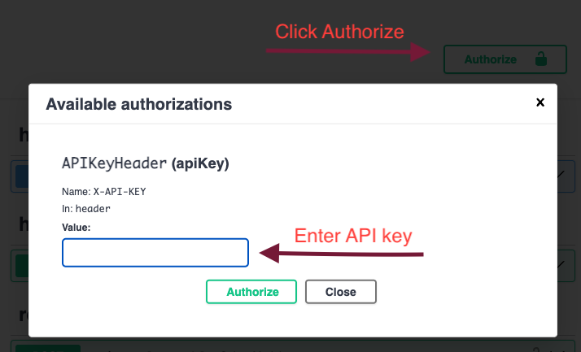
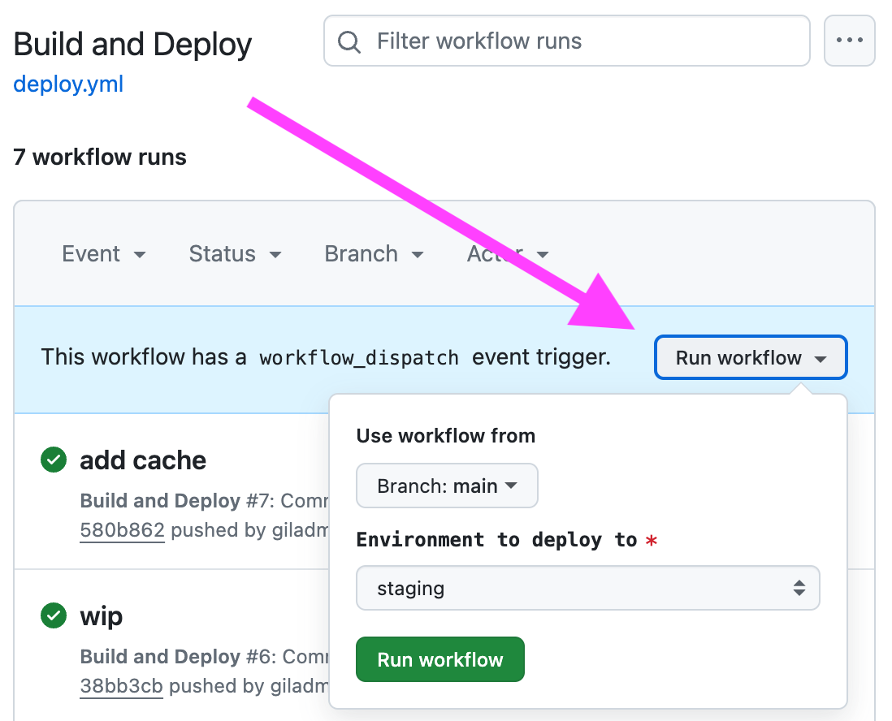

# Yupp LLMs

Multi Intelligence Neural Distribution (MIND) Service

## Purpose

The backend for providing services over multiple LLMs.

## Set Up, Build and Run

To get the backend to run, you need to set up several things:
1. Install Dependencies
1. Set up credentials
1. Build and run

### 1. Install Dependencies

The backend server is written in Python, so we need to install Python and all necessary dependencies. We use `miniconda`, `mamba` and `poetry` to manage Python dependencies.
<details>
<summary>More details about these librarires/tools</summary>

`miniconda` is a lightweight python distribution, a version of `anaconda`, a Python distribution that includes many packages and an environment manager; It has a component called `conda` that manages dependencies resolution and installation, and `mamba` is a faster alternative to it. `poetry` is a tool for dependency management specifically for Python packages.

</details>


#### miniconda 
- Install `miniconda` by following the [OS-specific instructions](https://docs.anaconda.com/miniconda/install/). For macOS with Apple Silicon:
    ```sh
    cd ~
    # download the installer script
    curl https://repo.anaconda.com/miniconda/Miniconda3-latest-MacOSX-arm64.sh > ./Miniconda3-latest-MacOSX-arm64.sh
    # this will install to ~/miniconda3 by default
    bash ./Miniconda3-latest-MacOSX-arm64.sh
    # the installer will ask, "Do you wish to update your shell profile to automatically initialize conda?"
    # respond with "yes" and let it do that.
    
    # after installation, remove the installer script
    rm ~/Miniconda3-latest-MacOSX-arm64.sh
    ```

#### mamba
Make sure Homebrew is installed. If not, follow instructions [here](https://brew.sh/).

- Insta mamba through the [recommended Miniforge distribution](https://mamba.readthedocs.io/en/latest/installation/mamba-installation.html). For macOS:
    ```sh
    brew install miniforge
    ```

#### Other Dependencies
- We also need redis and postgres installed. For macOS:
  ```sh
  brew install redis
  brew install postgresql@16    # only for local mode, also solves some psycopg2 issues
  ```

#### Create Virtual Environment

- In the repo root, run the following command to create a virtual environment `ys-dev`. This will create a minimal virtual environment.

  ```sh
  mamba env create -n ys-dev --file envs/dev.yml
  # needed the first time
  # assumes bash by default, but macOS defaults to zsh
  mamba init --shell zsh

  # make sure you do this every time you start a new terminal session
  mamba activate ys-dev

  # If this gives an error, you can also use conda to activate the environment
  conda activate ys-dev
  ```

- Confirm that the `ys-dev` environment is activated by running `mamba info --envs` and seeing `ys-dev` in the list with a `*` next to it. You will also see the text `(ys-dev)` in front of your command line prompt.

#### Actually Install Dependencies using poetry

- Now we actually install all dependencies **inside the virtual environment**, which is to be managed by [poetry](https://python-poetry.org/). Once you have the environment activated, run:

    ```sh
    poetry install --no-root
    ```
- Now all your dependencies are installed in the virtual environment.

### 2. Set Up Credentials

The backend server needs to load all necessary credentials from `.env` file in the repo root to access various services. We have these secrets stored in 1Password (and Vercel for production). To run the server locally, you need to create this file by downloading it from 1Password (it's under the entry "yupp-mind .env file"). Here is the command lines to do it on macOS using the command line:

  ```sh
  # Install 1Password CLI, which installs the package 'op'
  brew install 1password-cli
  # Add your 1Password yupp.ai account. Have your 1Password signin details handy
  # The sign-in address which will be asked is team-yupp.1password.com
  op account add

  # sign into the 1Password account, it might show some popup or ask you for info in the command line
  # If you have multiple accounts, make sure you choose the Yupp one.
  eval $(op signin)
  ```

- Download the `.env` file from 1Password, due to some 1Password CLI bug, we need to do some postprocessing to the output.

  ```sh
  op item get "yupp-mind .env file" --vault="Shared_dev" --fields text |  sed '1s/^"//; $s/"$//' | sed 's/\"\"/\"/g' > .env
  ```

Alternately, download it from 1Password web-ui.

#### Set Up GCP Service Account

The service sends logs and metrics to GCP under `yupp-llms` project. You need to pass
service acount credentials for this project. Download `GCP shared-local-dev service account`
in the `Shared_dev` vault in 1Password and set `GOOGLE_APPLICATION_CREDENTIALS` to the path
for the file.

```sh
  export GOOGLE_APPLICATION_CREDENTIALS=$HOME/yupp-llms-shared-local-dev-service-account.json

### 3. Build and Run

#### Build with Poetry

To add new dependencies or update the versions of existings ones, modify the `[poetry]` section in [pyproject.toml] and run `poetry update`. This will modify the locked package versions in [poetry.lock]. Do not modify that file directly.

Finally, install `ypl` as a package in the `ys-dev` environment:

```sh
poetry build
pip install -e .  # editable mode for dev
```

#### Runing the Server

The server could run in four modes:
- `local`: runs the server locally and have it talk to a local database.
- `staging`: runs the server in staging environment, using the production database.
- `production`: runs the server in production environment, using the production database.
- `test`: runs the server for test only, not the topic here (TBD)

You can start the server in any of these modes by specifying the `ENVIRONMENT` variable either in commandline, or in the first line `.env` file. for example:


- Local mode
  - Set up local database. See [here](ypl/db/local_pg_setup/README.md) for more details.
  - Update `.env` file: Uncomment local DB configuration (`POSTGRES_HOST` etc) and comment out the corresponding lines for staging.
  ```sh
  ENVIRONMENT=local uvicorn ypl.backend.server:app --reload
  ```
- Staging mode
  ```sh
  ENVIRONMENT=staging uvicorn ypl.backend.server:app --reload
  ```

Similarly for `production` and `test` modes.

After the server is up, in the `staging`/`local` mode, you can navigate to [localhost:8000/api/docs](http://localhost:8000/api/docs) to see all API endpoints available. See [Accessing the APIs](#accessing-the-apis) for more details using the endpoints seen here.


## Google Cloud Logging

Google Cloud Logging is disabled by default. To enable it, set `USE_GOOGLE_CLOUD_LOGGING=True` in the `.env` file. See 'Set Up GCP Service Account' above for GCP service account credentials.

In order to redact sensitive data, the `redact_sensitive_data` function is used. If you need to add new sensitive data patterns to redact, you can do so by adding them to the function.


## Accessing the APIs

The APIs are protected by API key. The key is stored in the Github Secrets (and Vercel Environment Variables), which will be injected as part of Github Actions Workflow. You can also find it in the `.env` file you set up earlier (look for `X_API_KEY`). If you want to access the API, you need to set the `X-API-KEY` header with the right key value.
At the moment, `local` environment is exempt from authentication and is enabled only for other (`staging` and `production`) environments.

If you need to access the APIs from FastAPI Docs, you can add the API key by clicking on `Authorize` button (top right).



## Testing

```sh
pytest
```

## Credentials

Important credentials (ie LLM API keys) can be found in 1Password.


## For Developers

### Project config

`pyproject.toml` is a configuration file to specify your project's metadata and to set the behavior of other tools such as linters, type checkers etc. You can learn more [here](https://packaging.python.org/en/latest/guides/writing-pyproject-toml/).

### Linting and type checking

This repo uses `ruff` for Python linting and `mypy` to make sure Python code is typed. Please download the IDE extensions for `ruff` and `mypy` from [here](https://code.visualstudio.com/docs/python/linting) to help with linting and type checking.

When using `mypy` in VSCode, you may need to enable the "Run using active interpreter" setting to make sure `mypy` uses the daemon in the virtual environment. You can find it by going to `Settings`, searching for `mypy.runUsingActiveInterpreter`, and checking the box. Make sure you have selected the right virtual environment. (You can do this by pressing Cmd-Shift-P and choose `Python: Select Interpreter` and select 'ys-dev' you created before.)


Github actions in `.github/workflows` are set up to run these linters on push and pull requests.

## Database migrations

With database model updates, migration scripts are generated and managed by alembic. Instructions here: [ypl/db/README.md](https://github.com/yupp-ai/yupp-mind/blob/main/ypl/db/README.md)

## Deployment

This repo uses `Docker` to build the backend image. For faster builds, a base image contains most of the expensive dependencies; when these are modified significantly, the base image should be rebuilt.

The `main` branch is auto-deployed nightly to llms-staging.yupp.ai.

### Rebuilding the base image (slow, infrequent, when many dependencies change):

Note: if you get an authentication error on `docker push`, run `gcloud auth login` followed by `gcloud auth configure-docker` first.

```sh
docker build \
  --platform linux/amd64 \
  -t gcr.io/yupp-llms/backend-base:latest \
  -f Dockerfile.base .

docker push gcr.io/yupp-llms/backend-base:latest
```

### Building and deploying the actual backend image, which depends on the base:

Use the "Run Workflow" button on the [Build and Deploy](https://github.com/yupp-ai/yupp-mind/actions/workflows/deploy.yml) workflow to build and deploy the backend image to staging or production; production will be pushed to llms.yupp.ai:




### Rollbacks

If you want to rollback to the previous revision, you can just use the [Rollback to previous revision](https://github.com/yupp-ai/yupp-mind/actions/workflows/rollback.yml) Github workflow.

To roll back to a different version, first list the revisions of the service (use `backend-staging` instead of `backend` to do the same for the staging service):

```sh
gcloud run revisions list --service=backend --region=us-east4 --platform=managed
```

This should result in a list of previous deploys:

```sh
   REVISION                   ACTIVE  SERVICE          DEPLOYED                 DEPLOYED BY
✔  backend-00004-qpm  yes     backend  2024-08-23 05:34:06 UTC  github-deploy@yupp-llms.iam.gserviceaccount.com
✔  backend-00003-nz8          backend  2024-08-23 05:24:52 UTC  github-deploy@yupp-llms.iam.gserviceaccount.com
✔  backend-00002-qjv          backend  2024-08-23 05:03:39 UTC  github-deploy@yupp-llms.iam.gserviceaccount.com
```

Choose the one to roll back to, and run:

```sh
gcloud run services update-traffic backend \
  --to-revisions=backend-00002-qjv=100 \
  --region=us-east4 \
  --platform=managed
```

## Periodic tasks

Periodic tasks are run using GitHub actions, based on [`.github/workflows/cronjob.yml`](.github/workflows/cronjob.yml)); any command and arguments to [cli.py](ypl/cli.py) can be run as a periodic task.

To add a new periodic task:
1. Add a command to [cli.py](ypl/cli.py) (ex: `update_ranking()`).
1. Create a GitHub action for that command with the desired schedule and any arguments to supply (ex: [`.github/workflows/update_ranking.yml`](.github/workflows/update_ranking.yml)).

Periodic tasks will run automatically from the `main` branch, but can also be manually triggered for any branch from [the action page](https://github.com/yupp-ai/yupp-mind/actions/workflows/cronjob.yml).
