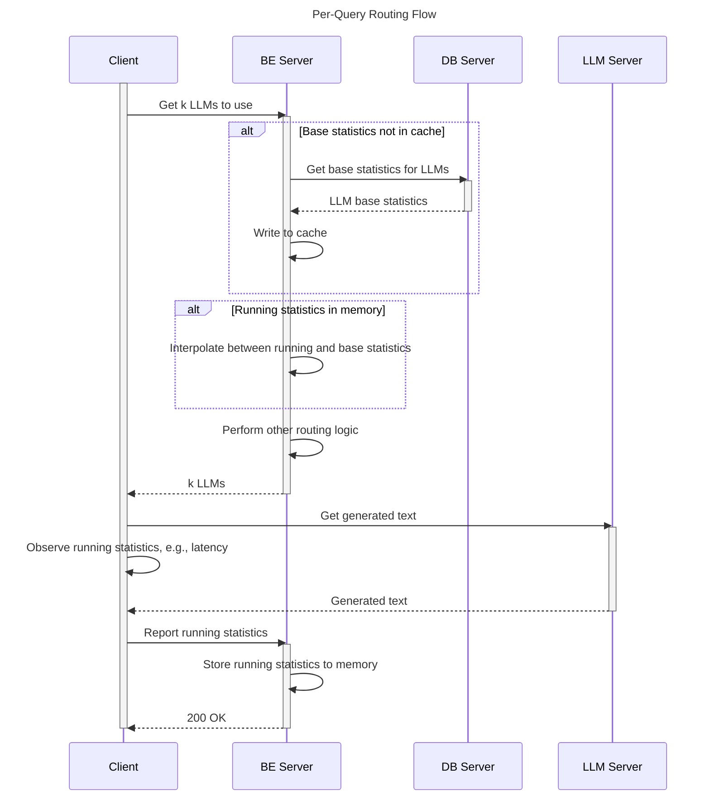

```mermaid
sequenceDiagram
title Per-Query Routing Flow
    activate Client
    Client->>BE Server:  Get k LLMs to use
        activate BE Server
        alt Base statistics not in cache            
                BE Server->>DB Server: Get base statistics for LLMs
                activate DB Server
                    DB Server-->>BE Server: LLM base statistics
                deactivate DB Server
                BE Server->>BE Server: Write to cache
        end
        alt Running statistics in memory
            BE Server->>BE Server: Interpolate between running and base statistics
        end
        BE Server->>BE Server: Perform other routing logic
        BE Server-->>Client: k LLMs
        deactivate BE Server
        
        Client->>LLM Server: Get generated text
        activate LLM Server
            Client->>Client: Observe running statistics, e.g., latency
            LLM Server-->>Client: Generated text
        deactivate LLM Server        
        
        Client->>BE Server: Report running statistics
        activate BE Server
            BE Server->>BE Server: Store running statistics to memory
            BE Server-->>Client: 200 OK
        deactivate BE Server
    deactivate Client
```
